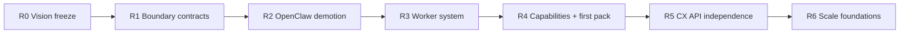

# Implementation Roadmap (Minimize Rework)

## Intent

Migrate OpenRabbit from a modular orchestration foundation into a runtime-agnostic AI operating environment **incrementally**.

Rules of engagement:

- preserve working tests and the commercial investment workflow
- prefer shims and adapters over rewrites
- land contracts and naming before large folder moves
- every phase must leave main shippable

## Phase overview

## R0 — Vision freeze (docs)

**Status:** in progress via architecture reset docs.

Deliverables:

- vision / glossary
- gap analysis
- target architecture
- folder structure
- this roadmap

Exit criteria:

- team agrees Platform / Runtime / Worker / Capability / Pack language
- no new features introduced with OpenClaw-as-product naming

## R1 — Boundary contracts and engineering seams

Deliverables:

1. New interfaces in `packages/runtime-core` (or successor contracts package):
   - `RuntimeProvider`
   - `WorkerDefinition` / worker preset types
   - `CapabilityModuleManifest`
   - `IntegrationAdapter`
   - `IndustryPackManifest`
2. Workflow composition ADR:
   - engine = kernel
   - workflows service = façade
3. Finish package boundary hardening:
   - `@openrabbit/*` entrypoint imports
   - CI green for all active packages
   - fix monorepo type resolution issues exposed by PR #13
4. Add `runtimes/`, `capabilities/`, `packs/`, `apps/` README ownership docs

Why first:

- stops new code from cementing the wrong shape
- low runtime risk
- unblocks parallel workstreams

Exit criteria:

- contracts exported and tested (type-level / unit stubs)
- CI enforces active package list
- ADR accepted for workflow layering

## R2 — Demote OpenClaw to a runtime adapter

Deliverables:

1. Create `runtimes/contracts` + `runtimes/openclaw` adapter package implementing `RuntimeProvider`.
2. In OpenRabbit app:
   - introduce generic runner/facade names
   - keep `createOpenClawSkillRunner` as deprecated shim calling adapter
3. Ban new OpenClaw imports outside adapter paths.
4. Map existing skill catalog execution through adapter session/task APIs.

Why this order:

- removes product lock-in early while behavior stays identical

Exit criteria:

- commercial workflow still runs
- platform core has zero direct OpenClaw dependencies
- shim deprecation documented

## R3 — Worker system

Deliverables:

1. Worker registry service/module (config-driven).
2. Presets:
   - Executive Assistant
   - Marketing Manager
   - Acquisitions Analyst
   - Finance Analyst
   - Operations Manager
   - Research Analyst
   - Customer Support
3. Worker orchestrator path:
   - resolve worker → create runtime session → project tools → run task → emit events → persist memory
4. Permissions:
   - worker can only access allowed capabilities/tools
5. Approval hooks integrated with workflow guardrails/policy

Existing seeds to reuse:

- `AgentRegistry`
- `services/orchestrator`
- `services/skills`
- policy/permission manager

Exit criteria:

- at least 2 worker presets executable via config
- task routing chooses runtime by worker preference
- unit tests cover allow-list enforcement

## R4 — Capability modules + Real Estate pack

Deliverables:

1. Capability manifest format + loader.
2. Migrate commercial investment analysis from app skill into:
   - `capabilities/real-estate` (workflow/tool)
   - `packs/real-estate` (preset workers + integrations list)
3. Define integration slots for HubSpot / MLS / Rentcast (connect-first; stubs allowed).
4. Org install/enable API for capabilities and packs (even if in-memory initially).

Philosophy check:

- prefer connecting CRM/email/calendar providers over rebuilding them

Exit criteria:

- commercial underwriting path runs from capability module
- pack install enables acquisitions worker preset
- app skill becomes thin wrapper or is removed after cutover

## R5 — Customer experience independence

Deliverables:

1. Public Platform API surface (versioned) for:
   - auth/org bootstrap
   - workers CRUD and task assignment
   - approvals inbox
   - capability/pack install
   - workflow status
   - CEO dashboard summary queries
2. `apps/` skeletons or contracts for web/dashboard/portal.
3. Explicit guidance: Hostinger Horizons consumes API only.

Exit criteria:

- a UI can be replaced without backend changes
- no business rules live only in frontend code

## R6 — Scale foundations

Deliverables:

1. Durable adapters:
   - memory datastore
   - event transport
   - orchestration/workflow state persistence + resume
2. Observability pipeline (logs/metrics/traces schema).
3. Runtime policy enforcement hooks in CI/release and hot paths.
4. Multi-tenant hard boundaries and audit trails.
5. Real deployment executors behind existing dry-run rollout scripts.

Exit criteria:

- single-node in-memory defaults no longer required for demo org reliability
- production runbook dry-run and execute paths both meaningful

## Parallel engineering tracks (allowed after R1)

| Track | Can proceed after | Notes |
|---|---|---|
| CI/package boundary hardening | R0 | should complete in R1 |
| Durable memory adapter spikes | R1 | behind interfaces only |
| Real estate capability extraction | R2 | needs runtime demotion to avoid claw leakage |
| Dashboard API prototyping | R3 | depends on worker model |
| Additional runtimes | R2 | implement RuntimeProvider only |

## Explicit sequencing anti-patterns

Do **not**:

- build many industry packs before capability manifests exist
- hardcode worker classes before WorkerDefinition config lands
- move all folders before contracts and CI are stable
- introduce Horizons-specific backend endpoints
- add a second workflow engine

## Near-term execution checklist (next 2–3 PRs)

1. Land this architecture reset doc set (this PR).
2. Add contract stubs + workflow composition ADR.
3. Fix package boundary CI (PR #13 follow-up) so monorepo imports resolve under `npm ci`.
4. Create `runtimes/openclaw` adapter skeleton and deprecate app-level OpenClaw naming.
5. Draft `capabilities/real-estate` manifest and migration plan for commercial workflow.

## Success metrics

Architecture migration is working if:

- new runtime integration effort is mostly confined to one adapter package
- new worker roles ship as JSON/YAML/manifest changes
- industry expansion does not require core service edits
- commercial workflow test coverage remains green throughout
- docs and code use the same glossary

## Relationship to older phase numbers

Older docs refer to Phases 10–12 (CI hardening, durable adapters, integrations). Those remain valid engineering workstreams and map as follows:

| Old phase idea | New roadmap home |
|---|---|
| CI / boundary hardening | R1 |
| Durable runtime adapters | R6 (spikes allowed earlier) |
| External integrations readiness | R4–R6 |
| Client readiness | R5 |

The older phases are necessary but not sufficient without R0–R4 product boundaries.
