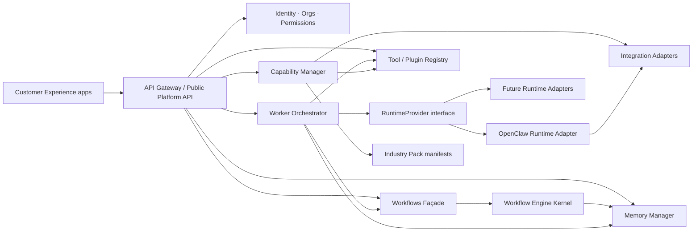
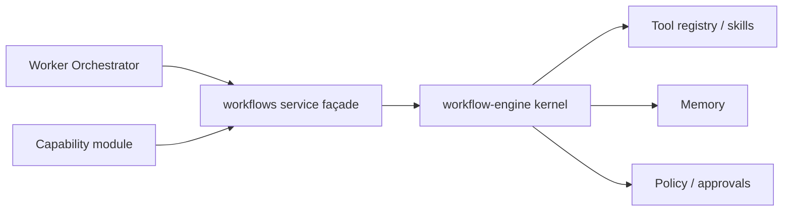

# Target Architecture: Runtime-Agnostic AI Operating Environment

## Purpose

Define the target technical architecture that realizes the OpenRabbit vision while preserving existing service foundations.

This is the design north star for incremental migration.

## Design principles

1. **Platform ≠ Runtime ≠ Worker ≠ Tool**
2. **Interfaces over frameworks**
3. **Orchestration over reimplementation**
4. **Config over hardcoding** for workers and packs
5. **Downward-only dependencies** across layers
6. **Backend independence from frontend tech**
7. **Incremental migration** with shims, not big-bang moves

## Logical architecture



## Core abstractions

These contracts should live in shared platform packages (initially extend `packages/runtime-core`, later split only if needed).

### 1. `RuntimeProvider`

Represents an AI runtime that can host worker execution.

Minimum surface:

```ts
interface RuntimeProvider {
  id: string;
  displayName: string;
  capabilities: string[]; // e.g. ["tools", "streaming", "memory-projection"]
  startSession(input: RuntimeSessionStart): Promise<RuntimeSession>;
  stopSession(sessionId: string): Promise<void>;
  runTask(input: RuntimeTaskRequest): Promise<RuntimeTaskResult>;
  // optional streaming later
  listProjectedTools?(sessionId: string): Promise<ToolRef[]>;
}
```

**Why:** OpenClaw becomes one adapter. New runtimes plug in without touching Core APIs.

**OpenClaw mapping:** existing skill runner + tool bridges implement this behind `runtimes/openclaw`.

### 2. `WorkerDefinition` + `WorkerOrchestrator`

Workers are configurable AI employees.

```ts
interface WorkerDefinition {
  id: string;
  orgId: string;
  role: string; // "executive_assistant" | "acquisitions_analyst" | custom
  displayName: string;
  mission: string;
  runtimePreference: string[]; // provider ids, ordered
  allowedCapabilities: string[];
  allowedTools: string[];
  memoryScope: "org" | "team" | "worker" | "thread";
  approvalPolicy: ApprovalPolicyRef;
  metadata?: Record<string, unknown>;
}
```

`WorkerOrchestrator` responsibilities:

- resolve worker config
- choose runtime provider
- project allowed tools/capabilities into runtime session
- route tasks and capture events
- enforce permissions and approval gates
- write/read memory in the worker’s scope

**Why:** specialization becomes data. Hiring a new “Marketing Manager” should not require a platform fork.

**Existing mapping:**

- `AgentRegistry` → low-level registry substrate
- `services/orchestrator` → evolves into worker/task orchestrator
- `services/skills` → executable skill/tool handlers available to workers

### 3. `CapabilityModule`

Installable business capability unit.

```ts
interface CapabilityModuleManifest {
  id: string;
  version: string;
  name: string;
  description?: string;
  tools?: ToolContribution[];
  workflows?: WorkflowContribution[];
  knowledgeSchemas?: string[];
  permissions?: PermissionContribution[];
  integrations?: string[]; // integration adapter ids required
  uiContributions?: UiContribution[]; // consumed by CX apps, not owned by core rendering
}
```

Lifecycle:

- discover
- install (org-scoped)
- enable / disable
- upgrade
- uninstall (with dependency checks)

**Why:** Real Estate underwriting and generic Email should not both be hardcoded into core services.

### 4. `IntegrationAdapter`

Normalizes external systems.

```ts
interface IntegrationAdapter {
  id: string;
  kind: "mcp" | "rest" | "graphql" | "webhook" | "oauth" | "custom";
  connect(config: IntegrationConfig): Promise<IntegrationHandle>;
  health(handle: IntegrationHandle): Promise<IntegrationHealth>;
  disconnect(handle: IntegrationHandle): Promise<void>;
}
```

**Why:** Layer 5 stays replaceable. MCP is one kind, not the only kind.

**Existing mapping:** `mcp/*` becomes the first integration family implementation.

### 5. `IndustryPack`

Composable preset bundle:

```ts
interface IndustryPackManifest {
  id: string;
  version: string;
  name: string;
  capabilities: string[]; // capability module ids
  integrations: string[];
  workerPresets: WorkerPreset[];
  workflowPresets?: string[];
  defaults?: Record<string, unknown>;
}
```

**Why:** sell and deploy industry solutions without forking OpenRabbit.

### 6. Workflow composition contract

Hard rule:

| Component | Role | Allowed to grow |
|---|---|---|
| `workflow-engine` | Deterministic execution kernel | validators, guardrails, runners, state transitions |
| `workflows` service | Platform façade / registry / dispatch API | catalog, permissions, org routing, API DTOs |
| capabilities | Domain workflow definitions/templates | business steps and templates |
| workers | Initiate/supervise workflows | not embed engine logic |



## Platform Core service map (target)

| Core concern | Target owner | Current seed |
|---|---|---|
| Public API | API Gateway | `services/api-gateway` |
| Identity / orgs / authZ | IAM + Policy | `services/policy` + future identity module |
| Worker orchestration | Worker Orchestrator | `services/orchestrator` + agent registry |
| Workflows | Façade + kernel | `services/workflows` + `workflow-engine` |
| Memory | Memory Manager | `services/memory` |
| Tools / plugins | Registry | runtime-core tool registry + `services/skills` |
| Model access | Model Gateway | `services/model-gateway` |
| Events | Event bus | runtime-core event bus |
| Clients | Client session/channel adapters | `services/clients` |

## Runtime Layer map

```
runtimes/
  contracts/           # RuntimeProvider and session types
  openclaw/            # first adapter
  <future-runtime>/
```

Rules:

- only `runtimes/openclaw/**` may import OpenClaw SDKs or claw-specific env
- Core may depend on `runtimes/contracts` only
- Workers select providers by id

## Capability and pack map

```
capabilities/
  crm/
  calendar/
  email/
  knowledge/
  documents/
  finance/
  marketing/
  sales/
  real-estate/
  ...

packs/
  real-estate/
  construction/
  healthcare/
  legal/
  ecommerce/
  smb/
```

Each capability is a module with a manifest. Packs only reference module IDs and presets.

## Customer Experience map

```
apps/
  web/
  mobile/
  ceo-dashboard/
  client-portal/
```

Rules:

- apps call public Platform API only
- Hostinger Horizons may generate/maintain one or more apps
- no direct DB access and no direct runtime SDK usage from apps

## Data ownership boundaries

| Data class | Owner | Notes |
|---|---|---|
| Users, orgs, memberships | Core IAM | multi-tenant root |
| Worker definitions | Core workers | config, not code |
| Workflow run state | Workflow kernel | durable later |
| Memory records | Memory manager | scoped by org/worker/thread |
| Capability install state | Capability manager | per org |
| Integration credentials | Secrets + integrations | never in frontend |
| Runtime session ephemeral state | Runtime adapter | may checkpoint to core events |

## Security and tenancy (architecture requirements)

Even before full implementation, APIs must assume:

- org-scoped authorization on every mutating call
- worker tool access is least-privilege
- approval gates are policy-driven
- secrets never cross into CX apps or model prompts by default
- audit events for worker actions and integration calls

Current policy service and permission manager are the seeds; enforcement hooks must become real over time.

## Scalability posture (without premature optimization)

Required now (architectural):

- stateless API gateway shape
- durable interfaces in front of memory/events/orchestration
- pack/capability install as data
- runtime adapters isolatable per process/service later

Deferred until measured:

- complex multi-region routing
- custom hyperscale schedulers
- heavy CQRS everywhere

## Anti-patterns (explicitly rejected)

1. **OpenClaw-as-core** — platform services importing claw runtime internals
2. **Mega-agent** — one agent prompt that “does the company”
3. **Fork-per-industry** — copying repo for each vertical
4. **Frontend-as-source-of-truth** — business rules only in Horizons/UI
5. **Skill dump directory as architecture** — unversioned scripts without manifests
6. **Parallel workflow engines** — two kernels with divergent semantics

## Compatibility strategy

During migration, provide shims:

- `createOpenClawSkillRunner` → deprecated wrapper over `RuntimeProvider` + worker/skill dispatch
- existing service packages keep npm names while folder ownership docs point to target layers
- commercial workflow remains executable while moving under `capabilities/real-estate`

Compatibility shims are allowed. Permanent dual semantics are not.
