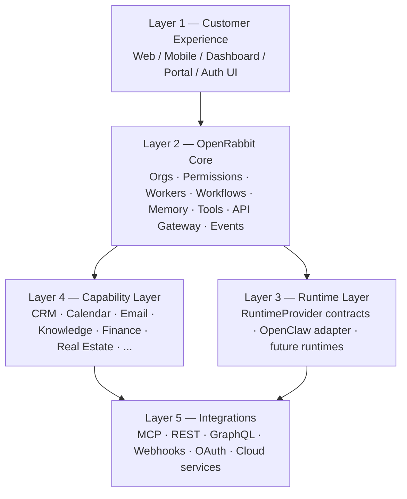

# OpenRabbit AI Operating Environment Vision

## What OpenRabbit is

OpenRabbit is **not** a chatbot.

OpenRabbit is **not** a single AI agent.

OpenRabbit is an **AI Operating Environment** that enables business owners to run their organizations alongside one or more **AI workers**.

Customers purchase **OpenRabbit the platform**. They do not purchase “an OpenClaw bot.” OpenClaw is one possible **runtime** that can operate *inside* OpenRabbit. Future runtimes must be first-class citizens without rewriting the product.

## Long-term objective

Build a modular platform where:

- different AI runtimes can operate in the same environment
- specialized AI workers can be configured, supervised, and replaced
- industry capabilities can be installed as packs rather than forked products
- the environment remains **runtime-agnostic**

Design as if OpenRabbit may eventually coordinate:

- dozens of AI workers per organization
- hundreds of connected tools
- thousands of workflows
- millions of users

Do not prematurely optimize, but refuse architectural choices that make that future impossible without a rewrite.

## Guiding separation (non-negotiable)

These concepts must remain separate in code, docs, APIs, and product language:

| Concept | Meaning | Examples |
|---|---|---|
| **OpenRabbit Platform** | The operating environment customers buy | orgs, auth, permissions, orchestration, memory, workflows, billing surface |
| **AI Runtime** | An execution engine adapter | OpenClaw today; other agent frameworks later |
| **AI Worker** | A specialized AI employee role | Executive Assistant, Marketing Manager, Acquisitions Analyst |
| **Capability Module** | Installable business capability | CRM, Email, Knowledge, Real Estate underwriting |
| **Integration** | Connector to external systems | MCP servers, REST, GraphQL, webhooks, OAuth apps |
| **Industry Pack** | Opinionated bundle of modules + workers + integrations | Real Estate Pack, Construction Pack, Law Firm Pack |

### Naming rules

- Product APIs and UI copy say **worker**, not “the bot.”
- Platform packages must not import a concrete runtime SDK except inside `runtimes/<name>/`.
- OpenClaw-specific types, env vars, and runners stay behind a `RuntimeProvider` adapter.
- Frontend technology (including Hostinger Horizons) is a **client** of the platform API, never part of core.

## Layered system

Dependency direction is strictly downward. Upper layers may call lower layers through stable interfaces only.

### Layer 1 — Customer Experience

- Web UI, mobile UI, CEO dashboard, client portal, authentication UX
- Hostinger Horizons may accelerate these interfaces
- Must remain swappable without changing platform core
- Talks only to public Platform APIs (Layer 2)

### Layer 2 — OpenRabbit Core

The heart of the product:

- user accounts and organizations
- permissions and policy
- worker orchestration
- workflow engine + workflow façade
- memory management
- tool registry and plugin management
- API gateway
- event system

Core owns **control plane** concerns. It does not hardcode industry logic or a single agent framework.

### Layer 3 — Runtime Layer

- Define runtime-agnostic interfaces first
- Ship OpenClaw as the first adapter implementation
- Allow multiple runtimes to coexist per org or per worker
- Never let platform services take a hard dependency on OpenClaw packages

### Layer 4 — Capability Layer

Everything business-specific is modular and installable/removable:

- CRM, Calendar, Email, Knowledge, Documents
- Finance, Marketing, Sales
- Real Estate, Construction, Healthcare, Legal, etc.

Capabilities contribute tools, workflows, knowledge schemas, permissions, and optional UI contributions. They do not fork core.

### Layer 5 — Integrations

Transport and vendor connectors:

- MCP servers
- REST / GraphQL APIs
- Webhooks
- OAuth
- Cloud services and third-party tools

New integrations should require adapter registration, not core rewrites.

## Philosophy

**Prefer orchestration over implementation.**

1. Connect an existing service when it is good enough.
2. If unavailable, build a reusable capability module.
3. Rebuild only when ownership, latency, compliance, or cost justifies it.

Workers should be **configurable**, not hardcoded class hierarchies.

Industry packs should **extend** core, never clone it.

## AI workers (product object)

Workers are specialized AI employees. Initial catalog (configurable presets, not frozen code):

- Executive Assistant
- Marketing Manager
- Acquisitions Analyst
- Finance Analyst
- Operations Manager
- Research Analyst
- Customer Support
- Future custom workers

A worker definition includes at minimum:

- role and mission
- allowed capabilities / tools
- preferred runtime(s)
- memory scope (org / team / worker / thread)
- escalation and approval policy
- evaluation / quality hooks

## Industry packs

Packs compose capabilities + default workers + integrations.

Example: **Real Estate Pack**

- MLS / Rentcast connectors
- HubSpot CRM capability
- property analysis and underwriting workflows
- Acquisitions Analyst worker preset

Other packs (Construction, Healthcare, Law, E-commerce, SMB) follow the same extension model.

## Non-goals (near term)

- Turning OpenRabbit into “a better ChatGPT wrapper”
- Hardcoding one mega-agent that does every job
- Making OpenClaw synonymous with the product
- Embedding Hostinger Horizons into backend core
- Big-bang rewrite of all existing services into new folders on day one

## Success criteria

OpenRabbit is on-vision when:

1. A new runtime can be added by implementing `RuntimeProvider` only.
2. A new worker can be added via config/manifest without core code changes.
3. A capability can be enabled/disabled per organization.
4. OpenClaw can be removed without collapsing Platform APIs.
5. Frontends can be replaced without backend redesign.
6. Existing valuable workflows (e.g. commercial investment analysis) continue to run during migration.
