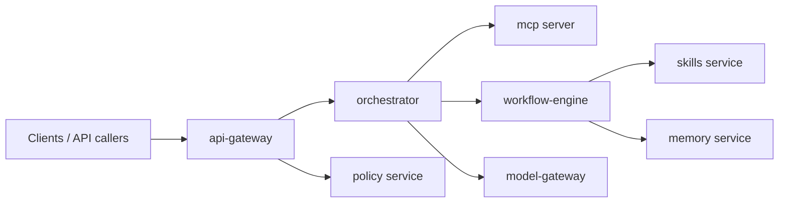
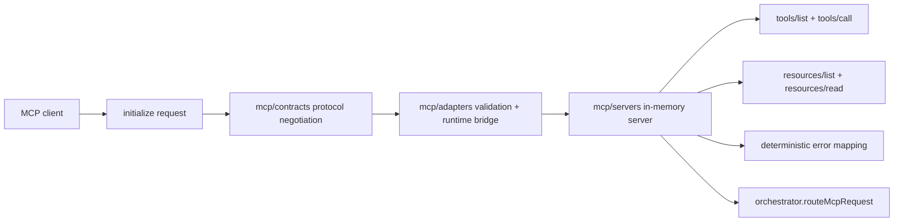
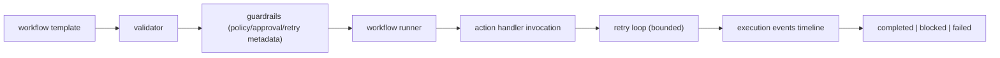
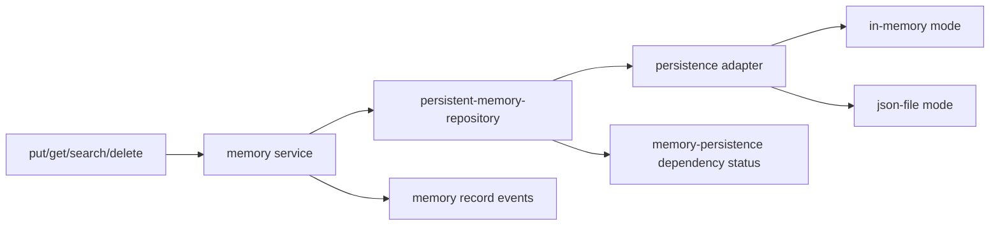

# Current Platform Overview
## Overall platform purpose
OpenRabbit is a TypeScript-first modular platform foundation for AI-powered orchestration, MCP interoperability, and domain workflow execution. The repository combines service scaffolds, a shared runtime core, deployment policies, and production rollout assets intended to evolve incrementally from in-process local implementations into production integrations.
## Repository map
- `packages/runtime-core`: shared contracts and in-memory/default runtime implementations.
- `services/*`: domain services (`api-gateway`, `orchestrator`, `model-gateway`, `policy`, `memory`, `skills`, `workflows`, `clients`) plus `workflow-engine`.
- `mcp/*`: MCP contracts, adapters, and in-process server.
- `workflows/templates`: declarative workflow templates.
- `deploy/*`: promotion gates, environment deployment configs, production rollout policy.
- `infra/*`: environment policies, secrets policy, deployment baseline, IaC scaffolding.
- `.github/workflows/ci.yml` + `scripts/*`: quality gates, bootstrap, release tooling.
- `domains`, `knowledge`, `integrations`, `clients`, `skills`, `specs`, `tests`: strategic directories currently mostly scaffolded.
## Current architecture
The current codebase follows an interface-first architecture:
- Service contracts are defined in `src/contracts.ts` per service.
- Services expose deterministic lifecycle and reliability APIs.
- Shared primitives (config/event bus/logging/permissions/retry/memory/mcp interfaces) come from `packages/runtime-core`.
- MCP uses a layered split (contracts → adapters → server) and is connected to orchestrator routing.
- Workflow execution has two tracks:
  - `services/workflow-engine`: richer deterministic runner + guardrails over declarative templates.
  - `services/workflows`: service-level registry/dispatch scaffold for workflow templates.
## Service boundaries
- `api-gateway`: request validation and permission-gated acceptance.
- `orchestrator`: task intake + MCP routing dispatch.
- `model-gateway`: model invocation abstraction over mock provider.
- `policy`: authorization decisions via permission manager.
- `memory`: persistence-aware memory storage service.
- `skills`: skill registry and skill execution handlers.
- `workflows`: workflow template registry and dispatch handlers.
- `clients`: client registry and client request dispatch.
- `workflow-engine`: guardrail-aware deterministic workflow runner.
- `mcp`: protocol boundary and tool/resource server implementation.
## Data flow

## Language breakdown
- Primary implementation language: TypeScript (Node ESM, strict TS configs).
- Infrastructure config languages: YAML and Terraform (HCL scaffold under `infra/iac/environments/prod`).
- Operational automation: Bash scripts.
- No Python services currently implemented.
## Current deployment model
- Environment and promotion policy is declarative:
  - `deploy/environments/{dev,staging,prod}.yaml`
  - `infra/environments/{dev,staging,prod}.yaml`
- Production rollout policy:
  - `deploy/production/rollout-strategy.yaml`
  - `deploy/production/services.yaml`
- Release scripts:
  - `scripts/release/promote.sh`
  - `scripts/release/deploy-prod.sh`
## Build process
- Per-package build/test model (no root workspace orchestrator).
- `packages/runtime-core` has a `build` script; service packages are test-focused.
- Type checking is done package-by-package with `npx tsc --noEmit -p tsconfig.json`.
## Testing process
- Unit tests use Vitest across runtime-core, MCP packages, and service packages.
- CI quality gates (`scripts/ci/run-quality-gates.sh`) run selected packages:
  - `packages/runtime-core`
  - `mcp/contracts`
  - `mcp/servers`
  - `services/orchestrator`
  - `services/workflow-engine`
- Additional newer services (`memory`, `skills`, `workflows`, `clients`, `mcp/adapters`) have tests but are not yet in the central quality gate script.
## Major design decisions already present
- Interface-first contracts before external integration.
- Deterministic error codes and reliability snapshots in services.
- In-memory defaults + file persistence option for memory.
- Protocol negotiation for MCP initialize.
- Guardrail-centric workflow model (approval/retry/policy hooks).
- Canary-oriented production rollout policy codified as configuration.
## Build and release flow

## MCP architecture

## Workflow execution flow

## Memory lifecycle

## Repository health report (1-10)
- Folder organization: 8/10
  - Clear top-level domains and phase-specific docs; some strategic dirs are placeholders.
- Naming consistency: 8/10
  - Mostly consistent service and contract naming; parallel `workflow-engine` vs `workflows` can confuse ownership.
- Module boundaries: 7/10
  - Good logical boundaries; deep relative imports into other package `src/` paths weaken package encapsulation.
- Testing coverage: 7/10
  - Strong unit coverage in implemented packages; central CI script does not include all new packages.
- Documentation quality: 8/10
  - Architecture docs are phase-specific and useful; some areas still stub-level.
- Security: 6/10
  - Policy and secrets posture documented; enforcement and runtime hardening are mostly policy scaffolds.
- Scalability: 6/10
  - Contracts and modularity are good; implementations are mostly in-memory and single-process.
- Maintainability: 8/10
  - Interface-first, deterministic patterns, and tests help; duplication across service scaffolds is rising.
- Developer experience: 7/10
  - Predictable package layout and scripts; no top-level workspace/test orchestrator and partial CI coverage.
- Production readiness: 6/10
  - Deployment policy and IaC scaffolds exist; major external integrations, observability backends, and hardening still pending.
## Current production readiness assessment
The platform is best classified as a Production Candidate foundation rather than production-ready runtime:
- Strengths: architecture direction, contracts, quality discipline, deployment policy codification.
- Gaps: external adapters, end-to-end integration tests, hardening/observability enforcement, and consolidated CI scope.
## Incremental roadmap recommendations
### Phase 10 - Operational hardening
Objectives
- Expand CI quality gates to all implemented packages.
- Add dependency boundary checks and package-import hardening.
- Add release script validation in CI (dry-run path).
Estimated complexity
- Medium.
Dependencies
- Existing CI workflow and release scripts.
Expected value
- High confidence in every merge; reduced regression risk.
### Phase 11 - Durable runtime adapters
Objectives
- Introduce production-grade adapters for memory, orchestration state, and event transport.
- Integrate workflow state snapshot persistence and resume semantics.
- Add centralized observability sink integration.
Estimated complexity
- Medium to Large.
Dependencies
- Stable service contracts from current phases.
Expected value
- Significant improvement in production resilience and scalability.
### Phase 12 - Integration and client readiness
Objectives
- Implement initial real integrations (`integrations/`) behind adapter contracts.
- Formalize client protocol/version contracts and compatibility testing.
- Add end-to-end workflow + MCP + client integration test path.
Estimated complexity
- Large.
Dependencies
- Phase 10 quality hardening and Phase 11 durable adapters.
Expected value
- Enables confident production rollout with real external connectivity.
