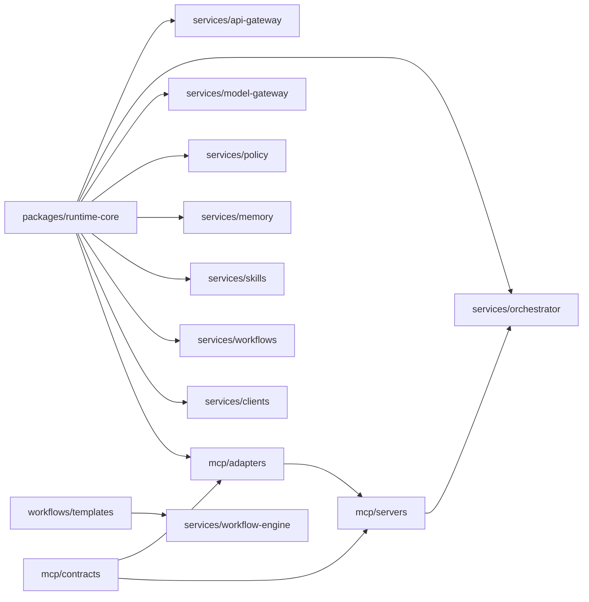
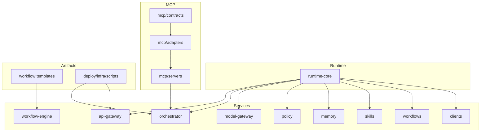

# Dependency Map
## Dependency analysis method
- Reviewed direct TypeScript imports across `packages/runtime-core`, `mcp/*`, and `services/*`.
- Reviewed CI/build scripts and package manifests for operational dependencies.
- Focused on concrete in-repo coupling, not intended future architecture.
## Layer model as implemented
- Layer 1: `packages/runtime-core` interfaces/core/mocks.
- Layer 2: `mcp/contracts`, `mcp/adapters`, `mcp/servers`.
- Layer 3: service packages (`services/*`), with `orchestrator` currently integrating MCP.
- Layer 4: deployment/infra/scripts and template artifacts (`deploy`, `infra`, `workflows/templates`).
## High-level graph

## Component dependencies
### `packages/runtime-core`
- Depends on: Node standard library only for some implementations.
- Consumers: all implemented services except `workflow-engine`, plus `mcp/adapters`.
### `mcp/contracts`
- Depends on: none in-repo.
- Consumers: `mcp/adapters`, `mcp/servers`.
### `mcp/adapters`
- Depends on: `mcp/contracts`, `packages/runtime-core` MCP interface.
- Consumers: `mcp/servers`.
### `mcp/servers`
- Depends on: `mcp/contracts`, `mcp/adapters`.
- Consumers: `services/orchestrator` via server registration.
### Core services (`api-gateway`, `orchestrator`, `model-gateway`, `policy`, `memory`, `skills`, `workflows`, `clients`)
- Depend on: `packages/runtime-core`.
- `orchestrator` is the only service directly MCP-aware at this phase.
### `services/workflow-engine`
- Depends on: internal modules + `workflows/templates`.
- No direct import dependency on runtime-core currently.
### Deploy/Infra/Scripts
- Runtime dependencies on shell tooling, git, ruby YAML parser in script path, and optional terraform binary.
## Circular dependencies
No direct TypeScript import cycles were identified in the implemented service/MCP/runtime paths.
## Coupling and boundary observations
Strengths
- Clear contract-per-service pattern.
- MCP layering is explicit and coherent.
- Runtime-core centralizes common operational primitives.
Risks
- Deep relative imports to other package `src/` paths bypass package publish boundaries.
- Two workflow layers (`workflow-engine` and `workflows`) overlap in responsibility.
- CI package list is hardcoded and currently omits multiple implemented packages.
## Clean boundaries currently present
- Protocol boundary: MCP contracts/adapters/server split.
- Operational boundary: service lifecycle + reliability snapshot pattern.
- Deployment boundary: declarative rollout/environment policy separated from service code.
## Layer violations or weak seams
- Services import runtime-core from `../../../packages/runtime-core/src/index.js` instead of package-resolved entry.
- `mcp/adapters` imports runtime-core interface internals by path rather than package name resolution.
- `workflow-engine` and `workflows` are parallel but not yet explicitly composed.
## Dependency graph by domain

## Suggested improvements (no code changes performed)
- Move to package-name imports (workspace-aware) to enforce boundaries.
- Add explicit architecture note describing `workflow-engine` as execution kernel and `workflows` as service façade (or vice versa).
- Expand `scripts/ci/run-quality-gates.sh` to include all implemented packages.
- Add dependency linting/static checks (e.g., forbidden relative cross-package imports).
