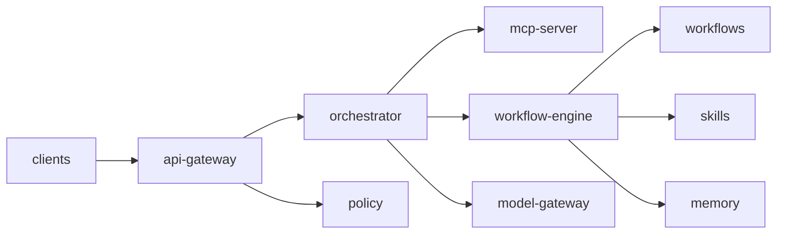

# Service Catalog
## Scope and maturity legend
- Mature: implemented with clear contracts, tests, and meaningful behavior.
- Emerging: implemented scaffold with contract/lifecycle/test baseline, limited external integration.
- Planned: mostly structural placeholders and documentation.
## API Gateway (`services/api-gateway`) - Emerging
Purpose
- Validate API request envelopes, evaluate permissions, emit accepted request events.
Responsibilities
- Request validation (`requestId`, `path`, `method`).
- Permission check bridge through runtime-core permission manager.
- Deterministic `ServiceOperationResult` responses and reliability snapshot.
Public interfaces
- `ApiGatewayService` contract in `services/api-gateway/src/contracts.ts`.
Dependencies
- `packages/runtime-core` (`configuration`, `event-bus`, `logging`, `permissions`, reliability types).
Consumers
- Intended upstream API clients; currently consumed via tests and architecture references.
Strengths
- Deterministic error handling and lifecycle discipline.
Weaknesses
- No transport/server binding yet (HTTP framework integration missing).
Technical debt
- Permission policies are hardcoded in-memory and not environment-driven.
Future scalability
- Strong if contracts remain stable and transport adapters are introduced at boundaries.
## Orchestrator (`services/orchestrator`) - Emerging
Purpose
- Coordinate task intake and route MCP requests to registered MCP server.
Responsibilities
- Idempotent task intake (`taskId` dedupe).
- MCP dispatch lifecycle with deterministic missing-state errors.
Public interfaces
- `OrchestratorService` in `services/orchestrator/src/contracts.ts`.
Dependencies
- `packages/runtime-core` (`configuration`, `event-bus`, `logging`).
Consumers
- MCP server integration point; future workflow/multi-agent coordinator.
Strengths
- Clear lifecycle and deterministic routing semantics.
Weaknesses
- Single in-memory registration, no persistence or distributed scheduling.
Technical debt
- No queueing/backpressure/fanout abstraction yet.
Future scalability
- Good contract baseline, but needs durable orchestration primitives for production load.
## Model Gateway (`services/model-gateway`) - Emerging
Purpose
- Abstract model provider invocation behind safe operation results and retry.
Responsibilities
- Invoke model through provider abstraction.
- Apply retry policy and reliability counters.
Public interfaces
- `ModelGatewayService` in `services/model-gateway/src/contracts.ts`.
Dependencies
- `packages/runtime-core` (`MockModelProvider`, logging, retry utility).
Consumers
- Future orchestrator/workflow paths requiring LLM invocation.
Strengths
- Safe vs throwing invocation APIs, reusable retry.
Weaknesses
- Currently mock-only provider registration.
Technical debt
- Provider routing/cost governance and observability are not yet externalized.
Future scalability
- High if provider adapters and policy governance are injected without contract churn.
## Policy (`services/policy`) - Emerging
Purpose
- Evaluate authorization decisions for service actions/resources.
Responsibilities
- In-memory policy storage and evaluation.
- Deterministic safe operation response for policy checks.
Public interfaces
- `PolicyService` in `services/policy/src/contracts.ts`.
Dependencies
- `packages/runtime-core` permission manager + logging + reliability types.
Consumers
- API gateway currently uses permission manager directly; policy service is available for expanded integration.
Strengths
- Explicit deny precedence model inherited from runtime-core.
Weaknesses
- Policy lifecycle is in-memory and static.
Technical debt
- No external policy source, audit stream, or policy versioning.
Future scalability
- Moderate; needs policy store and dynamic policy deployment path.
## Memory (`services/memory`) - Mature (for current phase)
Purpose
- Provide memory CRUD/search with pluggable persistence and deterministic lifecycle behavior.
Responsibilities
- Repository abstraction + persistence adapters.
- In-memory and JSON-file persistence modes.
- Reliability and persistence health signaling.
Public interfaces
- `MemoryService` + `MemoryRepository` + `MemoryPersistenceAdapter` in `services/memory/src/contracts.ts`.
Dependencies
- `packages/runtime-core` memory contracts, config/event/logging/reliability primitives.
Consumers
- Intended for workflows/orchestrator/skills; currently validated through unit tests.
Strengths
- Clean split between service, repository, and persistence adapter.
Weaknesses
- File persistence is local-node oriented; no distributed/transactional backend yet.
Technical debt
- Missing retention policies, indexing strategy, and multitenant durability controls.
Future scalability
- Good contract base; needs external datastore adapters and retention/governance controls.
## Skills (`services/skills`) - Emerging
Purpose
- Register, list, execute, and unregister skill handlers.
Responsibilities
- Skill registry and deterministic execution errors.
- Event emissions for skill lifecycle actions.
Public interfaces
- `SkillsService` and related contracts in `services/skills/src/contracts.ts`.
Dependencies
- `packages/runtime-core` config/event/logging/reliability primitives.
Consumers
- Intended for workflow engine/orchestrator as execution primitive layer.
Strengths
- Straightforward execution contract and deterministic failure behavior.
Weaknesses
- No version conflict strategy beyond duplicate id reject.
Technical debt
- No persisted skill catalog or validation against `skills/` directory metadata yet.
Future scalability
- Moderate-high with persisted skill registry and validation/publishing pipeline.
## Workflows Service (`services/workflows`) - Emerging
Purpose
- Registry and dispatch layer for workflow templates and handlers.
Responsibilities
- Register/list/unregister workflow templates.
- Dispatch workflow execution request to handler.
Public interfaces
- `WorkflowsService` in `services/workflows/src/contracts.ts`.
Dependencies
- `packages/runtime-core` config/event/logging/reliability primitives.
Consumers
- Intended orchestration-facing workflow service boundary.
Strengths
- Deterministic registry + execution result model.
Weaknesses
- Overlap risk with `services/workflow-engine` responsibilities.
Technical debt
- No explicit composition pattern documented between this service and workflow-engine.
Future scalability
- Needs clear layering contract to avoid duplicated workflow execution logic.
## Workflow Engine (`services/workflow-engine`) - Mature (within in-process scope)
Purpose
- Deterministic workflow execution over declarative templates with guardrails/retry/failure outcomes.
Responsibilities
- Template validation, guardrail checks, retry loops, event timeline generation.
Public interfaces
- Runner/contracts in `services/workflow-engine/src/contracts.ts`.
Dependencies
- Internal guardrail/validator modules and JSON templates under `workflows/templates`.
Consumers
- Orchestrator/workflow service integration target (partially conceptual currently).
Strengths
- Clear status model (`completed`, `blocked`, `failed`) and event timeline.
Weaknesses
- Policy and persistence are hook-ready but not integrated.
Technical debt
- Runtime state snapshot persistence/resume semantics not implemented.
Future scalability
- Strong deterministic core; needs distributed execution and state durability.
## Clients Service (`services/clients`) - Emerging
Purpose
- Register client channels and dispatch client requests.
Responsibilities
- Client descriptor registry.
- Request dispatch with deterministic not-found/failure handling.
Public interfaces
- `ClientsService` in `services/clients/src/contracts.ts`.
Dependencies
- `packages/runtime-core` config/event/logging/reliability primitives.
Consumers
- Intended as integration layer for web/mobile/desktop surfaces.
Strengths
- Channel-aware descriptor contract (`web/mobile/desktop`).
Weaknesses
- No transport/auth/session abstraction yet.
Technical debt
- No compatibility/version negotiation strategy between clients and services.
Future scalability
- Needs protocol adapters and client session/state handling.
## MCP (`mcp/contracts`, `mcp/adapters`, `mcp/servers`) - Mature (for in-process MCP scope)
Purpose
- Provide protocol contracts, runtime bridge adapters, and in-process MCP server behavior.
Responsibilities
- Request/response/tool/resource contracts.
- Protocol version negotiation (`initialize`).
- Deterministic routing and method error semantics.
Public interfaces
- Contracts in `mcp/contracts/src/index.ts`.
- Server interface in `mcp/servers/src/in-memory-mcp-server.ts`.
Dependencies
- `mcp/adapters` depends on runtime-core MCP interface.
- `mcp/servers` depends on adapters and contracts.
Consumers
- `services/orchestrator` routes MCP requests to registered MCP server.
Strengths
- Well-separated layers and explicit compatibility semantics.
Weaknesses
- No external transport listener or auth boundary.
Technical debt
- No capability negotiation beyond static supported version list.
Future scalability
- High if transport/auth/rate-limit adapters are added at server boundary.
## Knowledge (`knowledge/`) - Planned
Purpose
- Future indexing, retrieval, semantic access subsystem.
Current maturity
- Directory-level documentation only.
Dependencies
- Not yet concretely declared.
Public contracts
- None implemented in code.
Future recommendations
- Introduce interface-first contracts similar to runtime-core/services pattern.
## Integrations (`integrations/`) - Planned
Purpose
- Future connector layer (CRM, messaging, browser relay).
Current maturity
- Directory-level documentation only.
Dependencies
- Not yet concretely declared.
Public contracts
- None implemented in code.
Future recommendations
- Define integration adapter contracts and credential policy boundaries early.
## Infrastructure (`infra/`) - Emerging
Purpose
- Environment policies, baseline deployment policy, secrets policy, IaC module boundaries.
Current maturity
- Declarative baseline + production environment IaC scaffold.
Dependencies
- YAML/HCL + script-driven operational controls.
Public contracts
- Configuration contracts via environment YAML and Terraform variable/output files.
Future recommendations
- Add provider-specific modules and validation pipelines.
## Deployment (`deploy/` + `scripts/release`) - Emerging
Purpose
- Promotion policy and staged production rollout execution framework.
Current maturity
- Promotion rules, production rollout config, and rollout script simulation.
Dependencies
- Bash + YAML configs + git branch discipline.
Public contracts
- Environment gate definitions and rollout strategy files.
Future recommendations
- Integrate real deployment backend commands and post-deploy telemetry checks.
## Service relationship diagram

